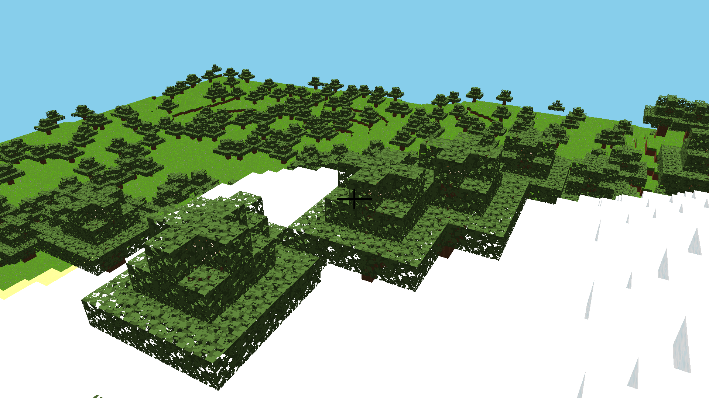

### Junkcraft

A simple Minecraft-like voxel game written in pure C and OpenGL.


Current features:

- Mesh culling rendering
- Basic random terrain generation with "looping" world
- Basic player movment physics - run and jump
- Break and place blocks
- Basic block variety and textures (in texture atlas)
- Generate terrain based on perlin noise
- Generate trees randomly

Planned features include:

- Technical
    - Frustrum culling
    - Possible greedy culling
    - Improved AABB collision and movement physics
    - Skybox
    - Maybe some form of LODs 
    - Terrain blend
- Gameplay
    - Terrain generation and biomes: Partially working 
    - Tree generation: Partially working
    - Cave generation
    - Day/night cycle
    - Entities 
    - Local play

#### Dependencies

- SDL2: for Windowing and getting a OpenGL context
- Freetype: For displaying text
- libm: Math 
- libjunk: Some handy utils and structs

#### Build steps

CMake with Makfiles:

```
mkdir build
cd build
cmake ..
make
```

### Screenshots



